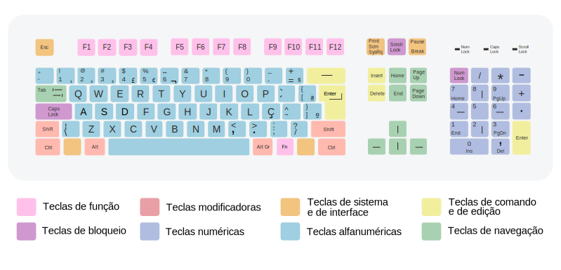

# Início


Fonte: Wikipedia. Acesso em: 30/mai/2023. Disponível em: <https://pt.wikipedia.org/wiki/Teclado_(inform%C3%A1tica)#/media/Ficheiro:Qwerty_pt_BR-ABNT2.svg>

## Teclas

- Teclas de função
- Teclas de bloqueio
- Teclas modificadoras
- Teclas numéricas
- Teclas de sistema e de interface
- Teclas alfanuméricas
- Teclas de comando e de edição
- Teclas de navegação

```{figure}

```